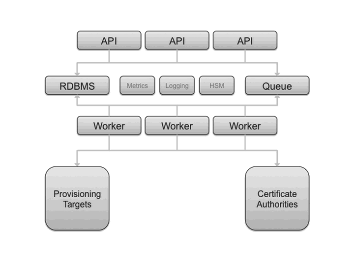
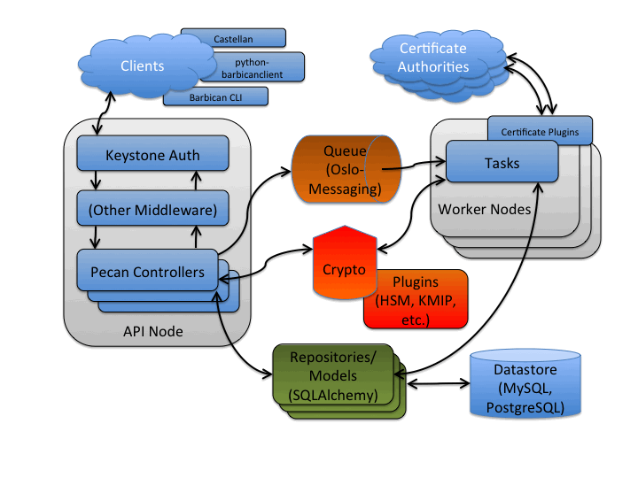

OpenStack 的key管理组件:
定位在提供 REST API 来安全存储、提供和管理“秘密”。
* 密钥：对称密钥、非对称密钥 
* 证书 
* 密码 
* 原始二进制数据

功能:
1. secrets 管理：此处的秘密是Barbican秘密
2. orders 管理：创建用户秘密后，再加密后形成Barbican秘密
3. containers 管理
4. ACL 管理 
5. 证书管理
6. 消费者管理 
7. 配额管理（便于计费）
