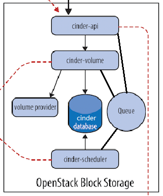

理解 Block Storage
操作系统获得存储空间的方式一般有两种： 
* 通过某种协议（SAS,SCSI,SAN,iSCSI 等）挂接裸硬盘，然后分区、格式化、创建文件系统；或者直接使用裸硬盘存储数据（数据库）
* 通过 NFS、CIFS 等 协议，mount 远程的文件系统

* 第一种裸硬盘的方式叫做 Block Storage（块存储），每个裸硬盘通常也称作 Volume（卷） 
* 第二种叫做文件系统存储。NAS 和 NFS 服务器，以及各种分布式文件系统提供的都是这种存储。 



### cinder-api
接收 API 请求，调用 cinder-volume 执行操作。

### cinder-volume
管理 volume 的服务，与 volume provider 协调工作，管理 volume 的生命周期。运行 cinder-volume 服务的节点被称作为存储节点。

### cinder-scheduler
scheduler 通过调度算法选择最合适的存储节点创建 volume。
基于容量、Volume Type 等条件选择出最合适的存储节点
1. AvailabilityZoneFilter
2. CapacityFilter
3. CapabilitiesFilter

Weighter: 基于存储节点的空闲容量计算权重值，空闲容量最大的胜出

### volume provider
数据的存储设备，为 volume 提供物理存储空间。
cinder-volume 支持多种 volume provider，每种 volume provider 通过自己的 driver 与cinder-volume 协调工作。

在 /etc/cinder/cinder.conf 中，cinder 通过 scheduler_driver， scheduler_default_filters 和 scheduler_default_weighers 这三个参数来配置 cinder-scheduler。

添加卷
在 /etc/lvm/lvm.conf 中的global_filter
pvcreate /dev/sdb
vgcreste xxxx /dev/sdb

修改配置文件


iSCSI 是 Client-Server 架构，有 target 和 initiator 两个术语。

Target
提供 iSCSI 存储资源的设备，简单的说，就是 iSCSI 服务器。

Initiator
使用 iSCSI 存储资源的设备，也就是 iSCSI 客户端。

Initiator 需要与 target 建立 iSCSI 连接，执行 login 操作，然后就可以使用 target 上面的块存储设备了。
Target 提供的块存储设备支持多种实现方式，我们实验环境中使用的是 LV。
Cinder 的存储节点 cinder-volume 默认使用 tgt 软件来管理和监控 iSCSI target，在计算节点 nova-compute 使用 iscsiadm 执行 initiator 相关操作。

如果一个 volume 存在 snapshot，则这个 volume 是无法删除的。
这是因为 snapshot 依赖于 volume，snapshot 无法独立存在。

在 LVM 作为 volume provider 的环境中，snapshot 是从源 volume 完全 copy 而来，所以这种依赖关系不强。
但在其他 volume provider（比如商业存储设备或者分布式文件系统），snapshot 通常是源 volume 创建快照时数据状态的一个引用（指针），占用空间非常小，在这种实现方式里 snapshot 对源 volume 的依赖就非常明显了。

attach/detach/extend/delete/snapshot/backup/restore

初看 backup 功能好像与 snapshot 很相似，都可以保存 volume 的当前状态，以备以后恢复。但二者在用途和实现上还是有区别的，具体表现在： 
* Snapshot 依赖于源 volume，不能独立存在；而 backup 不依赖源 volume，即便源 volume 不存在了，也可以 restore。
* Snapshot 与源 volume 通常存放在一起，都由同一个 volume provider 管理；而 backup 存放在独立的备份设备中，有自己的备份方案和实现，与 volume provider 没有关系。
* 上面两点决定了 backup 具有容灾功能；而 snapshot 则提供 volume provider 内便捷的回溯功能。

cinder-backup:<br>
Cinder 的 backup 功能是由 cinder-backup 服务提供的，devstack 默认没有启用该服务，需要手工启用。与 cinder-volume 类似，cinder-backup 也通过 driver 架构支持多种备份 backend，包括 POSIX 文件系统、NFS、Ceph、GlusterFS、Swift 和 IBM TSM。支持的driver 源文件放在 /opt/stack/cinder/cinder/backup/drivers/ 
 
/usr/bin/python /usr/local/bin/cinder-backup --config-file /etc/cinder/cinder.conf 

cinder backup-list<br>
```
[root@200-openstack ~]# grep -nri enabled_backends /etc/cinder/
/etc/cinder/cinder.conf:27:enabled_backends = lvmdriver-1,nfs
```
如果希望有多个 nfs 共享目录存放 volume，则可以添加到该文件中。

volume_driver=cinder.volume.drivers.nfs.NfsDriver

