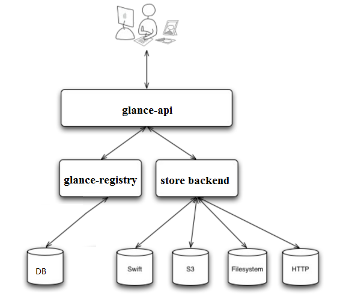
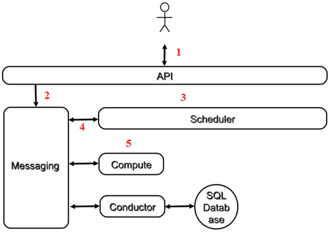

### glance-api
glance-api 是系统后台运行的服务进程。
对外提供 REST API，响应 image 查询、获取和存储的调用。

glance-api 不会真正处理请求。
如果是与 image metadata（元数据）相关的操作，glance-api 会把请求转发给 glance-registry；
如果是与 image 自身存取相关的操作，glance-api 会把请求转发给该 image 的 store backend。

### glance-registry
glance-registry 是系统后台运行的服务进程。
负责处理和存取 image 的 metadata，例如 image 的大小和类型。

### Store backend
Glance 自己并不存储 image。真正的 image 是存放在 backend 中的。

配置文件: /etc/glance/glance-api.conf 
glance image-list
glance image-create --name cirros --file /tmp/cirros-0.3.4-x86_64-disk.img --disk-format qcow2 --container-format bare --progress  
glance image-delete id

nova service-list  
### API
#### nova-api:
除了提供 OpenStack 自己的API，nova-api 还支持 Amazon EC2 API(无缝迁移)。

### Compute Core
#### nova-scheduler
虚机调度服务，负责决定在哪个计算节点上运行虚机

#### nova-compute
管理虚机的核心服务，通过调用 Hypervisor API 实现虚机生命周期管理

#### Hypervisor
计算节点上跑的虚拟化管理程序，虚机管理最底层的程序。
不同虚拟化技术提供自己的 Hypervisor。
常用的 Hypervisor 有 KVM，Xen， VMWare 等

#### nova-conductor
nova-compute 经常需要更新数据库，比如更新虚机的状态。
出于安全性和伸缩性的考虑，nova-compute 并不会直接访问数据库，而是将这个任务委托给 nova-conductor，

### Console Interface
#### nova-console
用户可以通过多种方式访问虚机的控制台：
* nova-novncproxy，基于 Web 浏览器的 VNC 访问
* nova-spicehtml5proxy，基于 HTML5 浏览器的 SPICE 访问
* nova-xvpnvncproxy，基于 Java 客户端的 VNC 访问

#### nova-consoleauth
负责对访问虚机控制台请求提供 Token 认证

#### nova-cert
提供 x509 证书支持

