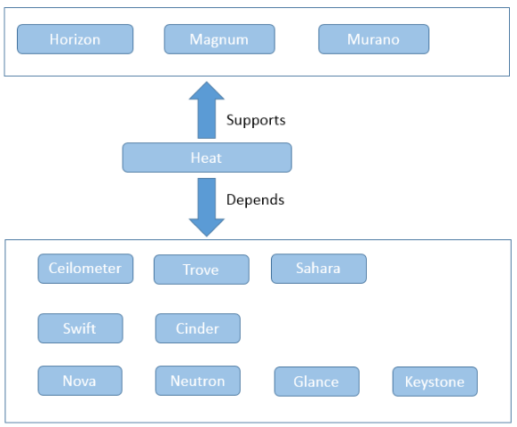
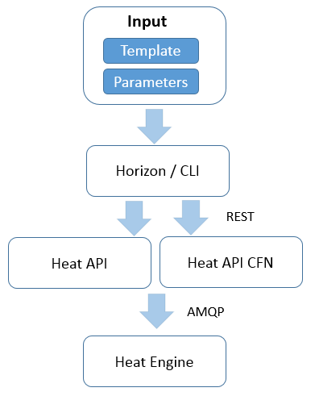
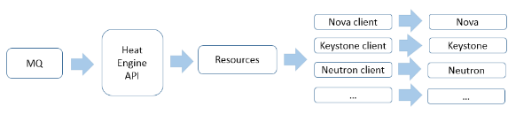
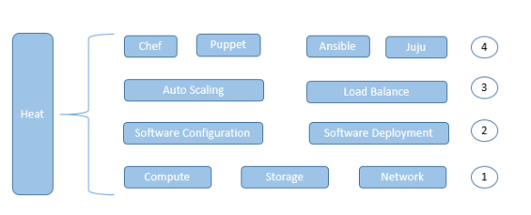

heat-UI:
https://github.com/openstack/heat-dashboard

heat-templates:
https://github.com/openstack/heat-templates

Tips:<br>
heat 要被配qos 才能用否则会报错
```shell
gnocchi metric list
gnocchi resource list
```

Heat 是一个基于模板来编排复合云应用的服务。 它目前支持亚马逊的 CloudFormation 模板格式，也支持 Heat 自有的 Hot 模板格式。模板的使用简化了复杂基础设施，服务和应用的定义和部署。模板支持丰富的资源类型，不仅覆盖了常用的基础架构，包括计算、网络、存储、镜像，还覆盖了像 Ceilometer 的警报、Sahara 的集群、Trove 的实例等高级资源。





* Heat-api 组件实现 OpenStack 天然支持的 REST API。该组件通过把 API 请求经由 AMQP 传送给 Heat engine 来处理 API 请求。
* Heat-api-cfn 组件提供兼容 AWS CloudFormation 的 API，同时也会把 API 请求通过 AMQP 转发给 heat engine。
* Heat-engine 组件提供 Heat 最主要的协作功能。

用户在 Horizon 中或者命令行中提交包含模板和参数输入的请求，Horizon 或者命令行工具会把请求转化为 REST 格式的 API 调用，然后调用 Heat-api 或者是 Heat-api-cfn。Heat-api 和 Heat-api-cfn 会验证模板的正确性，然后通过 AMQP 异步传递给 Heat Engine 来处理请求。



### 编排
安装中间件、配置中间件、安装应用程序、配置应用发布程序。对于复杂的需要部署在多台服务器上的应用，需要重复这个过程，而且需要协调各个应用模块的配置，比如配置前面的应用服务器连上后面的数据库服务器。

Heat 从四个方面来支持编排。
* 首先是 OpenStack 自己提供的基础架构资源，包括计算，网络和存储等资源。通过编排这些资源，用户就可以得到最基本的 VM。
* 值得提及的是，在编排 VM 的过程中，用户可以提供一些简单的脚本，以便对 VM 做一些简单的配置。然后用户可以通过 Heat 提供的 Software Configuration 和 Software Deployment 等对 VM 进行复杂的配置，比如安装软件、配置软件。
* 接着如果用户有一些高级的功能需求，比如需要一组能够根据负荷自动伸缩的 VM 组，或者需要一组负载均衡的 VM，Heat 提供了 AutoScaling 和 Load Balance 等进行支持。如果要用户自己单独编程来完成这些功能，所花费的时间和编写的代码都是不菲的。现在通过 Heat，只需要一段长度的 Template，就可以实现这些复杂的应用。Heat 对诸如 AutoScaling 和 Load Blance 等复杂应用的支持已经非常成熟，有各种各样的模板供参考。
* 最后如果用户的应用足够复杂，或者说用户的应用已经有了一些基于流行配置管理工具的部署，比如说已经基于 Chef 有了 Cookbook，那么可以通过集成 Chef 来复用这些 Cookbook，这样就能够节省大量的开发时间或者是迁移时间。本文稍后会分别对这四个方面做一些介绍。



Heat 目前支持两种格式的模板，一种是基于 JSON 格式的 CFN 模板；另外一种是基于 YAML 格式的 HOT 模板。CFN 模板主要是为了保持对 AWS 的兼容性。HOT 模板是 Heat 自有的，资源类型更加丰富，更能体现出 Heat 特点的模板。

一个典型的 HOT 模板由下列元素构成：
* 模板版本：必填字段，指定所对应的模板版本，Heat 会根据版本进行检验。
* 参数列表：选填，指输入参数列表。
* 资源列表：必填，指生成的 Stack 所包含的各种资源。可以定义资源间的依赖关系，比如说生成 Port，然后再用 port 来生成 VM。
* 输出列表：选填，指生成的 Stack 暴露出来的信息，可以用来给用户使用，也可以用来作为输入提供给其它的 Stack。

```
OS::Heat::CloudConfig： VM 引导程序启动时的配置，由 OS::Nova::Server 引用
OS::Heat::SoftwareConfig：描述软件配置
OS::Heat::SoftwareDeployment：执行软件部署
OS::Heat::SoftwareDeploymentGroup：对一组 VM 执行软件部署
OS::Heat::SoftwareComponent：针对软件的不同生命周期部分，对应描述软件配置
OS::Heat::StructuredConfig：和 OS::Heat::SoftwareConfig 类似，但是用 Map 来表述配置
OS::Heat::StructuredDeployment：执行 OS::Heat::StructuredConfig 对应的配置
OS::Heat::StructuredDeploymentsGroup：对一组 VM 执行 OS::Heat::StructuredConfig 对应的配置
OS::Neutron::Pool：定义资源池，一般可以由 VM 组成
OS::Neutron::PoolMember：定义资源池的成员
OS::Neutron::HealthMonitor：定义健康监视器，根据自定的协议，比如 TCP 来监控资源的状态，并提供给 OS::Neutron::Pool 来调整请求分发
OS::Neutron::LoadBalancer：关联资源池以定义整个负载均衡。
```

### Heat 和 IBM UCDP/UCD 的集成
随着云计算的逐步兴起，各种基于云计算的的部署编排工具开始出现了。从目前来看，主要有跨平台，可视化，强大的配置管理功能等几个方面。其中 IBM 的 UrbanCode Deploy with Patterns（UCDP）和 UrbanCode Deploy（UCD）是一种强大的平台，具备上述的特性。

UCDP 是全栈的环境管理和部署解决方案，支持用户为多种云设计、部署和更新全栈环境。该平台可集成 UCD，基于 Heat 来实现对 OpenStack 基础架构自动化来优化持续的交付吞吐量。它具备可视化的操作界面。通过拖拽图标来创建和编辑跨云平台的模板。

UCD 将应用、中间件配置以及数据库的变更进行编排并自动部署到开发环境、测试环境和生产环境中。它能让用户通过自助服务方式，根据需要或按照计划进行部署。在 UCD 中，能够按照配置（configuration-only）或者传统的代码和配置（code-and-configuration）来分拆复杂的应用配置进行逐步定义。

通过借助于 UCDP 强大的 Pattern 设计能力，我们可以通过拖拽的方式制作一个复杂的模板。其中用到两种类型的资源，一种是云计算资源，比如说网络、安全组、镜像等，另外是定义于 UCD 中的组件，比如其中的 Jke.db、MySQL Server、jke.war 和 WebSphere Liberty Profile.

首先，UCDP 把设计好的模板发给 Heat。然后 Heat 会调用 UCD 扩展插件来解释模板并翻译为 Heat 能够认识的模板，这个过程有可能需要访问 UCD 得到更为细节的解释。接着 Heat 去生成相应的资源，一般肯定有 VM，并在 VM 上安装 UCD agent，并启动 agent。Agent 会调用 UCD 拿到具体组件，比如 WebSphere Liberty Profile 的部署定义细节，然后执行。最终完成 Stack 的生成。


