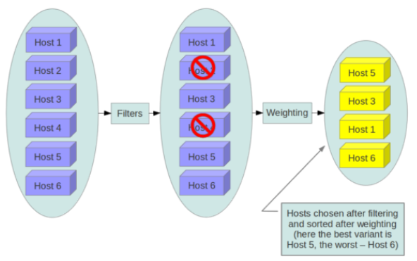

Filter scheduler 是 nova-scheduler 默认的调度器，调度过程分为两步： 
1. 通过过滤器（filter）选择满足条件的计算节点（运行 nova-compute）
2. 通过权重计算（weighting）选择在最优（权重值最大）的计算节点上创建 Instance。

允许使用第三方 scheduler，配置 scheduler_driver 



/etc/nova/nova.conf 中，nova 通过 scheduler_driver，scheduler_available_filters 和 scheduler_default_filters 这三个参数来配置 nova-scheduler。 <br>
不同版本有差异<br>
```
root@200-openstack ~]# grep -inr filter /etc/nova/nova.conf 
35:driver = filter_scheduler
37:[filter_scheduler]
39:enabled_filters = RetryFilter,AvailabilityZoneFilter,ComputeFilter,ComputeCapabilitiesFilter,ImagePropertiesFilter,ServerGroupAntiAffinityFilter,ServerGroupAffinityFilter,SameHostFilter,DifferentHostFilter
```
#### RetryFilter
RetryFilter 的作用是刷掉之前已经调度过的节点。 

举个例子方便大家理解： 假设 A,B,C 三个节点都通过了过滤，最终 A 因为权重值最大被选中执行操作。 但由于某个原因，操作在 A 上失败了。 默认情况下，nova-scheduler 会重新执行过滤操作（重复次数由 scheduler_max_attempts 选项指定，默认是 3）。 那么这时候 RetryFilter 就会将 A 直接刷掉，避免操作再次失败。 RetryFilter 通常作为第一个 filter。 

#### AvailabilityZoneFilter
为提高容灾性和提供隔离服务，可以将计算节点划分到不同的Availability Zone中。

#### RamFilter/DiskFilter/CoreFilter
将不能满足 flavor 内存需求的计算节点过滤掉。
ex:
ram_allocation_ratio = 1.5

#### ComputeFilter
ComputeFilter 保证只有 nova-compute 服务正常工作的计算节点才能够被 nova-scheduler调度。
ComputeFilter 显然是必选的 filter。

#### ComputeCapabilitiesFilter
ComputeCapabilitiesFilter 根据计算节点的特性来筛选。Compute 的 Capabilities就在 flavor --> Metadata中指定

#### ImagePropertiesFilter
ImagePropertiesFilter 根据所选 image 的属性来筛选匹配的计算节点。在image --> Metadata中 指定

#### ServerGroupAntiAffinityFilter
ServerGroupAntiAffinityFilter 可以尽量将 Instance 分散部署到不同的节点上。
nova server-group-create --policy anti-affinity group-1
nova boot --image IMAGE_ID --flavor 1 --hint group=group-1 inst1

#### ServerGroupAffinityFilter
与 ServerGroupAntiAffinityFilter 的作用相反，ServerGroupAffinityFilter 会尽量将 instance 部署到同一个计算节点上。
nova server-group-create --policy affinity group-2
nova boot --image IMAGE_ID --flavor 1 --hint group=group-2 inst1

### Weight
Scheduler 会对每个计算节点打分，得分最高的获胜。
目前 nova-scheduler 的默认实现是根据计算节点空闲的内存量计算权重值：
空闲内存越多，权重越大，instance 将被部署到当前空闲内存最多的计算节点上。

nova-compute 的功能可以分为两类：

1. 定时向 OpenStack 报告计算节点的状态
调用Driver相关的 API 获得资源信息

2. 实现 instance 生命周期的管理
nova-compute 创建 instance 的过程可以分为 4 步：
  - 为 instance 准备资源
    >分配内存、磁盘空间和 vCPU,网络资源
  - 创建 instance 的镜像文件
    >1. 首先将该 image 下载到计算节点<br>
    >2. 然后将其作为 backing file 创建 instance 的镜像文件。<br>
    >>qcow2 格式的镜像需要通过 qemu-img 转换成 raw 格式。转换的原因是下一步需要将其作为 instance 的镜像文件的 backing file，而 backing file不能是 qcow2 格式。
  - 创建 instance 的 XML 定义文件
  > 资源相关定义
  - 创建虚拟网络并启动虚拟机

  

  


