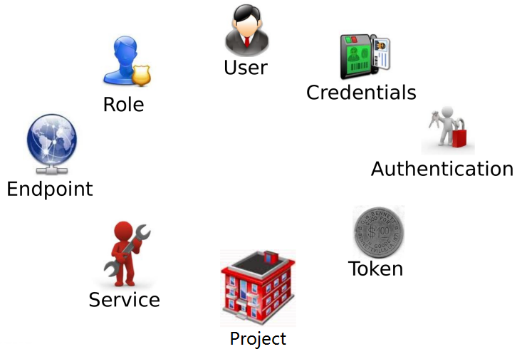

OpenStack 是一个分布式系统，由若干不同功能的节点（Node）组成：
1. 控制节点（Controller Node）<br>
管理 OpenStack，其上运行的服务有 Keystone、Glance、Horizon 以及 Nova 和 Neutron 中管理相关的组件。<br>
控制节点也运行支持 OpenStack 的服务，例如 SQL 数据库（通常是 MySQL）、消息队列（通常是 RabbitMQ）和网络时间服务 NTP。 <br>       

2. 网络节点（Network Node）<br>
其上运行的服务为 Neutron。<br>
为 OpenStack 提供 L2 和 L3 网络。<br>
包括虚拟机网络、DHCP、路由、NAT 等。      <br>  

3. 存储节点（Storage Node）<br>
提供块存储（Cinder）或对象存储（Swift）服务。<br>        

4. 计算节点（Compute Node）<br>
其上运行 Hypervisor（默认使用 KVM）。<br>
同时运行 Neutron 服务的 agent，为虚拟机提供网络支持。<br>        


### User:
任何使用 OpenStack 的实体，可以是真正的用户，其他系统或者服务。
除了 admin 和 demo，OpenStack 也为 nova、cinder、glance、neutron 服务创建了相应的 User。 admin 也可以管理这些 User。

### Credentials:
是 User 用来证明自己身份的信息，可以是： 1. 用户名/密码 2. Token 3. API Key 4. 其他高级方式

### Authentication:
Keystone 验证 User 身份的过程, User 访问 OpenStack 时向 Keystone 提交用户名和密码形式的 Credentials，Keystone 验证通过后会给 User 签发一个 Token 作为后续访问的 Credential。

### Token
1. Token 用做访问 Service 的 Credential
2. Service 会通过 Keystone 验证 Token 的有效性
3. Token 的有效期默认是 24 小时

### Project
用于将 OpenStack 的资源（计算、存储和网络）进行分组和隔离。 根据 OpenStack 服务的对象不同，Project 可以是一个客户（公有云，也叫租户）、部门或者项目组（私有云）。
1. 资源的所有权是属于 Project 的，而不是 User。
2. 在 OpenStack 的界面和文档中，Tenant / Project / Account 这几个术语是通用的，但长期看会倾向使用 Project
3. 每个 User（包括 admin）必须挂在 Project 里才能访问该 Project 的资源。 一个User可以属于多个 Project
4. admin 相当于 root 用户，具有最高权限

### Service
OpenStack 的 Service 包括 Compute (Nova)、Block Storage (Cinder)、Object Storage (Swift)、Image Service (Glance) 、Networking Service (Neutron) 等。
每个 Service 都会提供若干个 Endpoint，User 通过 Endpoint 访问资源和执行操作。

### Endpoint
Endpoint 是一个网络上可访问的地址，通常是一个 URL。 Service 通过 Endpoint 暴露自己的 API。 Keystone 负责管理和维护每个 Service 的 Endpoint。

### Role
安全包含两部分：Authentication（认证）和 Authorization（鉴权） Authentication 解决的是“你是谁？”的问题 Authorization 解决的是“你能干什么？”的问题
配置文件: policy.json

```shell
source devstack/openrc admin admin 
openstack catalog list
openstack endpoint list
openstack role list
```

## 基本架构
### API 前端服务
每个 OpenStack 组件可能包含若干子服务，其中必定有一个 API 服务负责接收客户请求。<br>
ex: nova-api

### Scheduler 调度服务
对于某项操作，如果有多个实体都能够完成任务，那么通常会有一个 scheduler 负责从这些实体中挑选出一个最合适的来执行操作。<br>
nova-scheduler 

### Worker 工作服务
调度服务只管分配任务，真正执行任务的是 Worker 工作服务。<br>
nova-compute

### Driver 框架
以 Nova 为例，OpenStack 的计算节点支持多种 Hypervisor。 包括 KVM, Hyper-V, VMWare, Xen, Docker, LXC 等。 <br>
Nova-compute 为这些 Hypervisor 定义了统一的接口，hypervisor 只需要实现这些接口，就可以 driver 的形式即插即用到 OpenStack 中。 下面是 nova driver 的架构示意图 

开放性的体现<br>
配置文件: /etc/nova/nova.conf<br>

### Messaging 服务
MQ, 异步调用
* 解耦各子服务: 子服务不需要知道其他服务在哪里运行，只需要发送消息给 Messaging 就能完成调用。
* 提高性能: 异步调用使得调用者无需等待结果返回。这样可以继续执行更多的工作，提高系统总的吞吐量。
* 提高伸缩性: 子服务可以根据需要进行扩展，启动更多的实例处理更多的请求，在提高可用性的同时也提高了整个系统的伸缩性。而且这种变化不会影响到其他子服务，也就是说变化对别人是透明的。

### Database
各组件维护自己的状态信息
